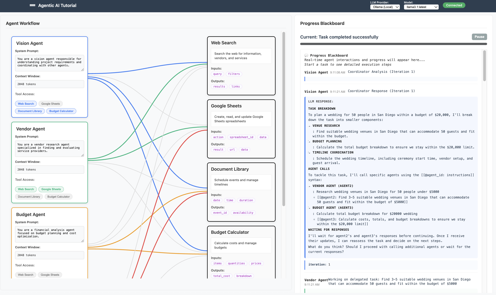

# Agentic AI Tutorial - LangGraph Agent Interface

A real-time web interface for monitoring and interacting with LangGraph agent workflows. This project provides a complete modular architecture for building and managing multi-agent AI systems.



## 🚀 Features

- **Real-time Agent Monitoring**: WebSocket-based live updates of agent status and execution
- **Modular JavaScript Architecture**: Clean separation of concerns across 5 specialized modules
- **Interactive UI**: Dynamic agent cards with editable prompts and tool connections
- **Tool Management**: Visual representation of agent-tool interactions with toggle controls
- **Document Library**: Upload and vectorize documents for RAG (Retrieval-Augmented Generation) search
- **Task Execution**: Execute complex multi-agent workflows with live progress tracking
- **LLM Integration**: Support for OpenAI and Ollama (local) models
- **Responsive Design**: Modern, clean interface with streamlined navigation
- **Real-time Tool Execution**: Web search, budget calculations, Google Sheets integration, and document search

## � Prerequisites

### Required
- **Python 3.8+**: The backend requires Python 3.8 or higher
- **Modern web browser**: With WebSocket support (Chrome, Firefox, Safari, Edge)

### LLM Providers (Choose One or Both)

#### Option 1: Ollama (Local Models - Recommended for Privacy)
- **Install Ollama**: Download from [ollama.ai](https://ollama.ai) 
- **Pull a model**: Run `ollama pull llama3.1:latest` or your preferred model
- **Start Ollama**: The service should be running on `localhost:11434`
- **Benefits**: Free, private, runs locally, no API keys needed

#### Option 2: OpenAI (Cloud Models - Recommended for Performance)
- **API Key Required**: Set the `OPENAI_API_KEY` environment variable
  ```bash
  export OPENAI_API_KEY="your-openai-api-key-here"
  ```
- **Benefits**: Fast, powerful models like GPT-4, GPT-3.5-turbo

#### Both Providers (Recommended)
You can configure both providers to switch between local and cloud models as needed.

## �🚀 Quick Start

1. **Clone the repository**
   ```bash
   git clone <repository-url>
   cd agentic
   ```

2. **Set up Python virtual environment**
   ```bash
   python -m venv venv
   source venv/bin/activate  # On macOS/Linux
   pip install -r requirements.txt
   ```

3. **Start the application**
   ```bash
   ./restart.sh
   ```

4. **Open your browser**
   Navigate to `http://localhost:3000` to use the interface

5. **Try the Document Library**
   - Upload documents using the Document Library tool
   - Click "Vectorize for RAG Search" to add them to the vector database
   - Run tasks that can search and retrieve from your documents

## 🏗️ Architecture

### Frontend (JavaScript Modules)
- `s1-websocket.js` - WebSocket communication and connection management
- `s2-rendering.js` - Agent/tool card rendering and SVG connections  
- `s3-execution.js` - Task lifecycle and execution management
- `s4-interactions.js` - Event handling, user interactions, and document upload
- `s5-app.js` - Application initialization and state management

### Backend (Python)
- `python_server.py` - WebSocket server for real-time communication
- `llm_integration.py` - LLM provider integration (OpenAI/Ollama)
- `langgraph_workflow.py` - LangGraph workflow implementation
- `tools.py` - Tool execution framework with Web Search, Budget Calculator, Google Sheets, and Document Library

### Frontend Assets
- `index.html` - Main application entry point
- `style.css` - Complete styling with responsive design
- `restart.sh` - Development server restart script
   - Connection management and status monitoring
   - Message sending and receiving
   - Reconnection handling and error recovery

1. **`s1-websocket.js`** - WebSocket Communication
   - Connection management and status monitoring
   - Message sending and receiving
   - Reconnection handling and error recovery

2. **`s2-rendering.js`** - UI Rendering Engine
   - Agent and tool card rendering
   - Connection line drawing between components
   - Dynamic UI updates and state visualization
   - Special Document Library tool card with upload interface

3. **`s3-execution.js`** - Task Execution System
   - Task workflow simulation and management
   - Progress tracking and agent highlighting
   - Results display and export functionality

4. **`s4-interactions.js`** - User Interactions & Document Management
   - All user interface interactions and event listeners
   - Model selection and workflow controls
   - Document upload and vectorization functionality
   - Prompt editing and keyboard shortcuts

5. **`s5-app.js`** - Application Core
   - Main application state management
   - Module coordination and message routing
   - WebSocket message handling and routing
   - Sample data initialization and global state

### Benefits of Modular Design

- **Maintainable**: Each module has a single, clear responsibility
- **Testable**: Modules can be debugged and tested independently
- **Reusable**: Components can be easily moved to other projects
- **Scalable**: New features can be added without cluttering existing code
- **Debuggable**: Module loading status is tracked and reported

## Current Architecture

### Frontend (HTML/CSS/JavaScript)
- **Three-panel layout**: Agents | Tools | Blackboard
- **Dynamic card generation**: Agent and tool cards with real-time updates
- **WebSocket client**: Connects to backend for live data streaming
- **Responsive design**: Clean, professional interface matching the reference design

### Backend
- **Python WebSocket Server** (`python_server.py`): Real-time communication with LLM integration
- **Tool Execution Framework** (`tools.py`): Web Search, Budget Calculator, Google Sheets, Document Library
- **LLM Integration** (`llm_integration.py`): OpenAI and Ollama provider support

## Current Status

✅ **Completed**
- [x] Basic UI layout and styling
- [x] WebSocket communication infrastructure
- [x] Dynamic card rendering system
- [x] Real-time activity logging
- [x] Python virtual environment setup
- [x] **Python WebSocket server with LangGraph integration**
- [x] **Real agent and tool monitoring foundation**
- [x] **Monitored agent base classes**
- [x] **Document Library tool with RAG vectorization workflow**
- [x] **Complete tool execution framework (Web Search, Budget Calculator, Google Sheets, Document Library)**
- [x] **Multi-agent coordinator workflow with iterative task execution**
- [x] **Real-time LLM integration with OpenAI and Ollama support**

🚧 **Current Features**
- ✅ **Real-time multi-agent task execution**
- ✅ **Document upload and vectorization for RAG search**
- ✅ **WebSocket-based tool execution and monitoring**
- ✅ **Coordinator-agent delegation workflow**
- ✅ **Live progress tracking with agent highlighting**
- ✅ **Interactive agent prompt editing**

## Development Roadmap & TODO List

### ✅ **PHASE 1: Core Execution Features** (COMPLETED!)

#### **Task Input & Execution** ✅
- [x] **Task Input Panel**
  - [x] Add task description textarea to main UI
  - [x] "Run Workflow" button with loading states
  - [x] Task validation and preprocessing
  - [x] Clear previous results functionality

- [x] **Real-time Execution Monitor**
  - [x] Current active agent indicator
  - [x] Progress bar for workflow completion
  - [x] Step-by-step execution log
  - [x] Pause/Resume/Stop controls

- [x] **Results Display System**
  - [x] Dedicated results panel in UI
  - [x] Final output formatting and display
  - [x] Intermediate results from each agent
  - [x] Export results (JSON, Markdown, Plain text)

- [x] **Error Handling & Recovery**
  - [x] Error display in UI
  - [x] Retry failed steps
  - [x] Graceful degradation for failed agents/tools
  - [x] Debug information for developers

### 🔧 **PHASE 2: Enhanced Customization** (High Priority - Current Focus)

#### **Dynamic Agent Management**
- [ ] **Add/Remove Agents**
  - [ ] "Add Agent" button and form
  - [ ] Delete agent functionality
  - [ ] Agent role templates (researcher, writer, analyst, etc.)
  - [ ] Drag & drop agent reordering

- [ ] **Agent Configuration**
  - [ ] Per-agent LLM settings (temperature, max_tokens, etc.)
  - [ ] Agent dependency mapping (which agents can call others)
  - [ ] Agent execution order and priorities
  - [ ] Custom agent prompt templates

#### **Advanced Tool Management**
- [ ] **Tool Library & Custom Tools**
  - [ ] Browse available tools interface
  - [ ] Add custom tool definitions
  - [ ] Tool parameter configuration UI
  - [ ] Tool testing and validation

- [ ] **Tool Results & Monitoring**
  - [ ] Real-time tool execution status
  - [ ] Tool output display and formatting
  - [ ] Tool performance metrics
  - [ ] Tool error handling and retries

### 🏗️ **PHASE 3: Workflow Management** (Medium Priority)

#### **Workflow Templates & Persistence**
- [ ] **Save/Load Workflows**
  - [ ] Export complete workflow configurations
  - [ ] Import and load saved workflows
  - [ ] Workflow versioning and history
  - [ ] Quick workflow templates

- [ ] **Template Gallery**
  - [ ] Pre-built workflow examples
  - [ ] Community template sharing
  - [ ] Template categorization and search
  - [ ] Template rating and reviews

#### **Advanced Configuration**
- [ ] **Environment Management**
  - [ ] API key management interface
  - [ ] LLM provider configuration
  - [ ] Global workflow settings
  - [ ] User profile and preferences

### 📊 **PHASE 4: Monitoring & Analytics** (Medium Priority)

#### **Performance Monitoring**
- [ ] **Real-time Metrics Dashboard**
  - [ ] Token usage tracking and costs
  - [ ] Execution time per agent/tool
  - [ ] Success/failure rates
  - [ ] Memory usage monitoring

- [ ] **Conversation & Audit Logging**
  - [ ] Complete conversation history between agents
  - [ ] LLM prompt/response logging
  - [ ] Audit trail for all actions
  - [ ] Search and filter logs

#### **Visualization Enhancements**
- [ ] **Advanced Connection Mapping**
  - [ ] Dynamic workflow visualization
  - [ ] Agent communication flow diagrams
  - [ ] Tool dependency graphs
  - [ ] Execution timeline view

### 🚀 **PHASE 5: Advanced Features** (Lower Priority)

#### **Collaboration & Sharing**
- [ ] **Multi-user Support**
  - [ ] Shared workflow sessions
  - [ ] Real-time collaboration
  - [ ] User authentication and permissions
  - [ ] Team workspace management

#### **Production Features**
- [ ] **Deployment & Integration**
  - [ ] Docker containerization
  - [ ] Cloud deployment scripts
  - [ ] API for external integrations
  - [ ] CI/CD pipeline setup

### 🎯 **Current Sprint Focus**

**Week 1-2**: Task Input & Execution ✅ **COMPLETED**
1. ✅ Fix JavaScript syntax errors and UI display
2. ✅ Add task input panel to UI
3. ✅ Add "Run Workflow" button with loading states
4. ✅ Implement simulated workflow execution with visual feedback
5. ✅ Add results display panel with export functionality

**Week 3-4**: Enhanced Customization (Current Sprint)
1. ⏳ **NEXT**: Add "Add Agent" button and dynamic agent creation
2. ⏳ Add agent role templates (researcher, writer, analyst, etc.)
3. ⏳ Implement tool library browser with add/remove functionality
4. ⏳ Add per-agent LLM configuration (temperature, max_tokens)
5. ⏳ Save/load workflow configurations

**Success Metrics for Phase 1**: ✅ Users can input a task, run the workflow, see real-time execution progress, and view/export results
**Success Metrics for Phase 2**: Users can customize agents, add/remove tools, and save/load workflow templates

---

## What's New in Latest Update

### ✨ **Phase 1 Features Just Added:**

1. **Task Input Panel**: 
   - Clean textarea for task descriptions
   - Smart validation and UI state management
   - Example placeholder text for guidance

2. **Real-time Execution Monitoring**:
   - Live progress bar showing completion percentage
   - Step-by-step execution log with timestamps
   - Visual highlighting of currently active agent
   - Pause/stop controls for user control

3. **Professional Results Display**:
   - Slide-up results panel with final output
   - Separate display for each agent's contribution
   - JSON export functionality for integration
   - Clear/close controls for workflow management

4. **Enhanced Agent Visualization**:
   - Active agent highlighting with red glow effect
   - Smooth animations and state transitions
   - Professional styling matching modern interfaces

5. **Error Handling & UX**:
   - Connection status awareness
   - Loading states and user feedback
   - Graceful degradation for connection issues

### 🎮 **How to Use the New Features:**

1. **Start a Task**: Type your task in the input field (e.g., "Plan a wedding for 150 people")
2. **Run Workflow**: Click "Run Task" and watch agents execute in real-time
3. **Monitor Progress**: See which agent is active and track execution steps
4. **View Results**: Review comprehensive results and export if needed
5. **Customize Agents**: Edit agent names and system prompts directly in the UI

### 🚀 **Demo Ready!**
The interface is now a fully functional demo that showcases:
- How multi-agent systems work
- Real-time agent coordination
- Professional workflow execution
- Customizable agent configurations

---

## TBDs (Legacy - Moved to Roadmap Above)

### High Priority

1. **~~Replace Node.js with Python Backend~~** ✅ **COMPLETED**
   - [x] Create Python WebSocket server using `websockets` library
   - [x] Integrate with actual LangGraph workflows
   - [x] Implement real agent and tool monitoring

2. **LangGraph Integration** 🚧 **IN PROGRESS**
   - [x] Create sample LangGraph workflow with multiple agents
   - [x] Implement agent state monitoring hooks
   - [x] Add tool execution tracking
   - [ ] Capture LLM prompt/response pairs (basic implementation done)
   - [ ] Add more complex workflow examples
   - [ ] Integrate with actual LLM providers (OpenAI, etc.)

3. **Enhanced Agent Cards**
   - [ ] Show agent execution history
   - [ ] Display agent memory/state persistence
   - [ ] Add agent performance metrics
   - [ ] Show inter-agent communication patterns

4. **Advanced Tool Monitoring**
   - [ ] Real-time tool parameter validation
   - [ ] Tool execution timing and performance
   - [ ] Error handling and retry logic visualization
   - [ ] Tool dependency mapping

### Medium Priority

5. **Blackboard Enhancements**
   - [ ] Filtering and search functionality
   - [ ] Export logs to file
   - [ ] Different view modes (compact, detailed, debug)
   - [ ] Timestamp and execution order tracking

6. **Configuration System**
   - [ ] Agent configuration via UI
   - [ ] Tool parameter customization
   - [ ] Workflow routing visualization
   - [ ] Save/load workflow configurations

7. **Performance Monitoring**
   - [ ] Agent execution timing
   - [ ] Memory usage tracking
   - [ ] Token consumption monitoring
   - [ ] Cost tracking for LLM calls

### Low Priority

8. **Advanced Visualization**
   - [ ] Flow diagrams showing agent interactions
   - [ ] Execution timeline visualization
   - [ ] Agent decision tree display
   - [ ] Network graph of agent/tool relationships

9. **Collaboration Features**
   - [ ] Multi-user monitoring support
   - [ ] Shared workflow sessions
   - [ ] Comment system for debugging
   - [ ] Workflow sharing and templates

10. **Integration & Deployment**
    - [ ] Docker containerization
    - [ ] Cloud deployment scripts
    - [ ] CI/CD pipeline setup
    - [ ] Production monitoring and logging

## Installation & Setup

### Prerequisites
- Python 3.8+
- Modern web browser with WebSocket support
- Optional: Ollama for local LLM support

### Setup Instructions
```bash
# Clone and setup virtual environment
git clone <repository-url>
cd agentic
python -m venv venv
source venv/bin/activate  # On macOS/Linux
pip install -r requirements.txt

# Start the application
./restart.sh
```

### Next Steps
1. Add real LLM integration (OpenAI API, etc.)
2. Create more complex workflow examples
3. Implement enhanced monitoring features

## Project Structure
```
.
├── index.html              # Main UI layout
├── style.css               # Complete UI styling
├── s1-websocket.js         # WebSocket communication module
├── s2-rendering.js         # UI rendering and card generation
├── s3-execution.js         # Task execution and progress tracking
├── s4-interactions.js      # User interactions and document upload
├── s5-app.js               # Application core and message routing
├── python_server.py        # WebSocket server with LLM integration
├── llm_integration.py      # OpenAI and Ollama provider support
├── langgraph_workflow.py   # LangGraph workflow implementation
├── tools.py                # Tool execution framework
├── requirements.txt        # Python dependencies
├── restart.sh              # Development restart script
├── .venv/                  # Python virtual environment
├── archive/                # Legacy files and backups
├── documentation/          # Project documentation
└── README.md               # This file
```

## Contributing

This project demonstrates a complete multi-agent AI system with real-time monitoring, document upload/vectorization, and LLM integration. The modular architecture makes it easy to extend with new agents and tools.

## License

[To be determined]
